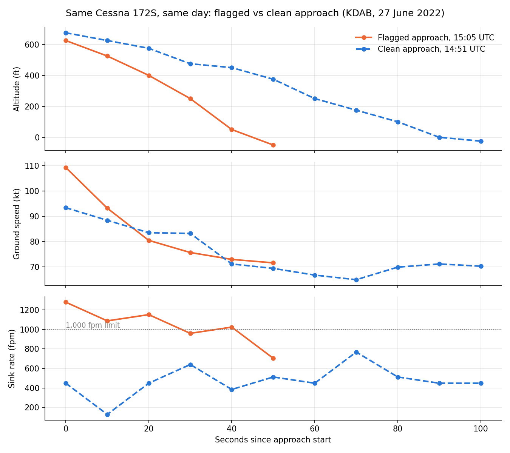
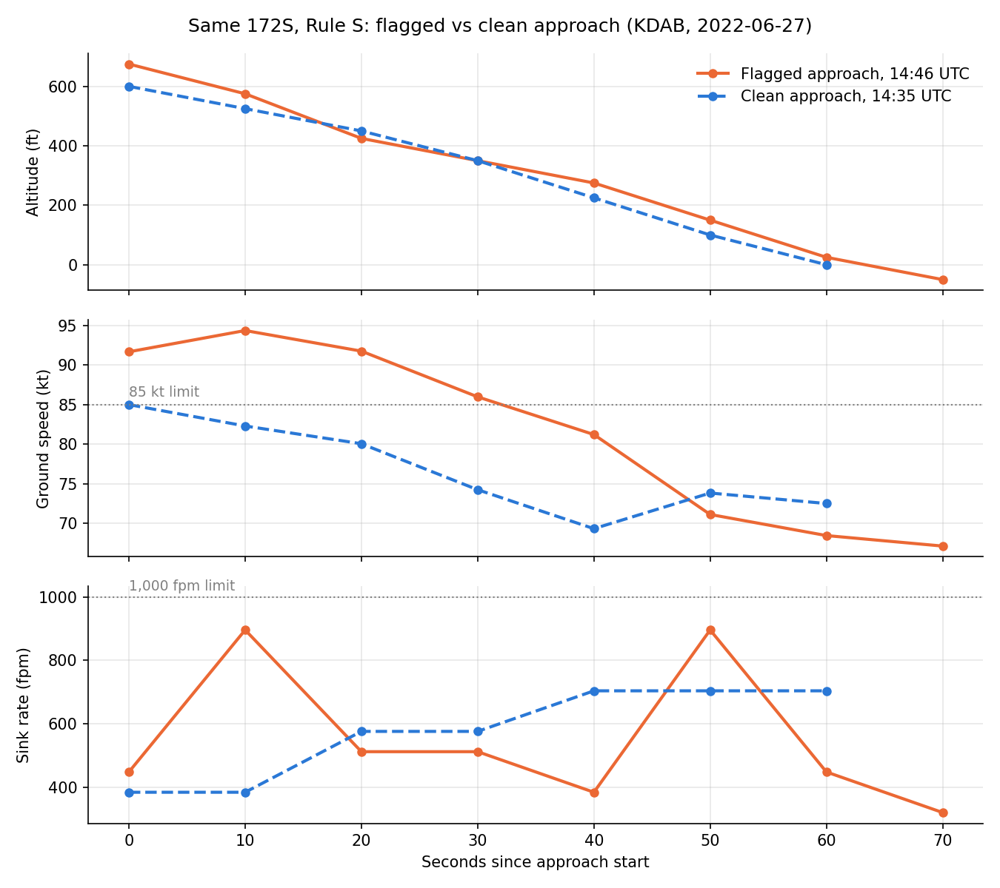
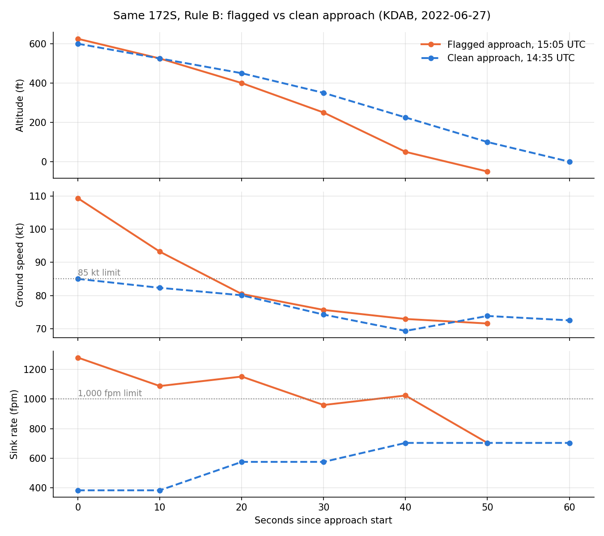

# GA Unstable Approach Warning

Early warning for unstable approaches in general aviation flight training, built on public ADS-B data.

## What this project does

- Loads OpenSky Network ADS-B data near Daytona Beach International Airport (KDAB)
- Removes frozen ADS-B reports
- Cuts each flight track into individual approaches, ending at touchdown
- Drops fragments (approaches starting below 500 ft or with fewer than 5 reports)
- Keeps training aircraft only (Cessna 152/172/182, Piper PA-28, Diamond DA40/DA42)
- Flags approaches with two rules:
  - Rule B (sink): two back-to-back reports with sink rate over 1,000 fpm, above 100 ft
  - Rule S (speed): two back-to-back reports with ground speed over the type limit, between 100 and 500 ft (85 kt for Cessna 172 and Piper PA-28)
- Builds a blind labeling sheet for flight instructor review
- Scores both rules against instructor labels

## How to run

1. Put the OpenSky hour files (.tar) and the aircraft database (.csv) in a Google Drive folder named `opensky`
2. Open a Colab notebook, paste `full_pipeline.py` and run
3. To add a day, put its hour files in the folder and add the date to `DAYS` at the top of the script

## Results so far

Data: 27 June 2022, 14:00 to 17:00 UTC

- Aircraft near KDAB: 98
- Approaches: 105
- Training aircraft approaches: 90
- Fragments removed: 18
- Approaches for instructor review: 72
- Rule B flags: 1
- Rule S flags: 6
- Flagged by either rule: 7 (10%)

One approach triggered both rules: a Cessna 172S starting at 625 ft, 109 knots ground speed, sinking over 1,000 fpm for 30 seconds.

Five of six Rule S flags come from aircraft flying a single approach, likely straight-in arrivals. Ground speed includes wind, so instructor review decides whether these are true unstable approaches.

## Known data limits

- ADS-B reports ground speed, not airspeed. Wind shifts ground speed.
- Barometric altitude uses standard pressure (29.92 inHg), not the local altimeter setting.
- Vertical rate comes in 64 fpm steps. Altitude comes in 25 ft steps.
- Reports arrive about every 10 seconds.
- OpenSky repeats the last known state for up to 300 seconds after coverage loss. This project removes those rows.
- ADS-B identifies the aircraft, not the pilot.
- Speed limits are starting values, to be calibrated against instructor labels.
- Results cover three hours at one airport.

## Next steps

- Instructor review of the 72 approaches (in progress)
- Score both rules against instructor labels
- Calibrate speed limits
- More days of data

## Data source

OpenSky Network: https://opensky-network.org

Project development and research by Sam Suseelan

